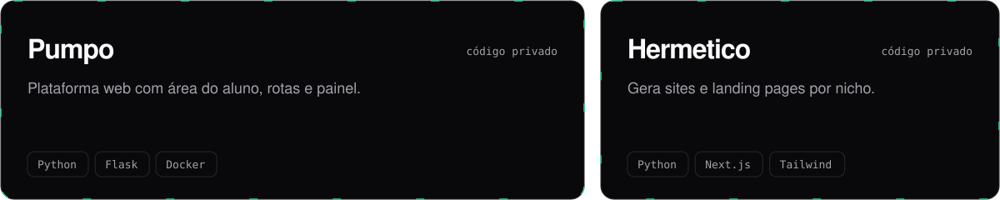
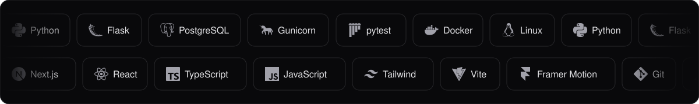

<picture>
  <source media="(prefers-color-scheme: light)" srcset="assets/hero-light.svg" />
  
</picture>

### Sobre

Gosto de pegar uma ideia e levar até virar produto: modelar os dados, escrever a API, desenhar a interface e colocar no ar. No back-end trabalho com Python e Flask; no front, com Next.js, TypeScript e Tailwind.

 

### Projetos

Os dois têm código privado. Se quiser ver algo rodando, me chama.

<picture>
  <source media="(prefers-color-scheme: light)" srcset="assets/projects-light.svg" />
  
</picture>

 

### Stack

<picture>
  <source media="(prefers-color-scheme: light)" srcset="assets/stack-light.svg" />
  
</picture>

 

### Em foco agora

- Evoluindo o **Pumpo** e o **Hermetico** com entregas semanais
- Testes automatizados com `pytest` nos fluxos principais
- Animações de interface com Framer Motion

 

### Contribuições

<picture>
  <source media="(prefers-color-scheme: dark)" srcset="https://raw.githubusercontent.com/Kam4-brisa/Kam4-brisa/output/github-snake-dark.svg" />
  
</picture>
